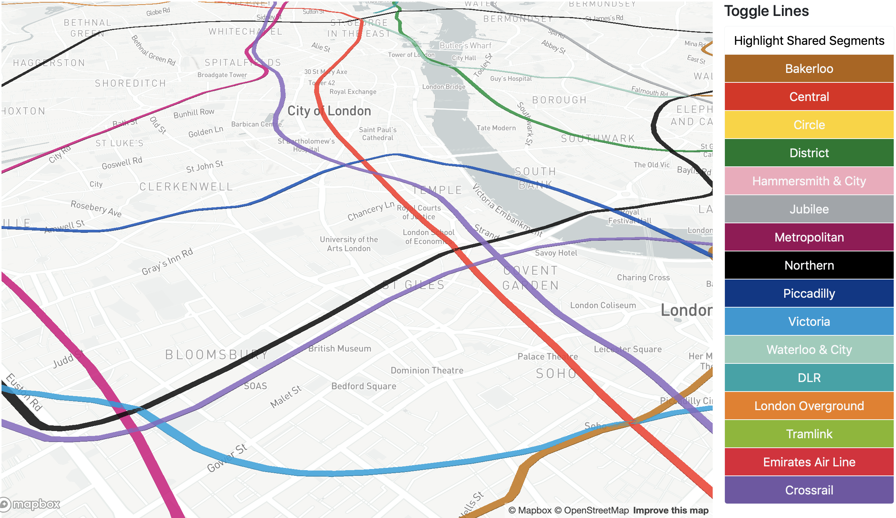

# Why Would You Do This?

Honestly, I have no idea.

## How

First, I grabbed former colleague Ollie O'Brien's [excellent source of data](https://github.com/oobrien/vis).  
Then, I post-processed the TfL GeoJSON he provides, because MapBox's filter expressions are annoying to use on nested arrays, and Mapbox Gl JS can only extrude Polygons, as opposed to LineStrings. You can see the notebook I used [here](process_lines.ipynb).

## Further Work

Who can say?

## Closing Thoughts
It's telling that it was easier to get TfL line data from a third party than from an official data store, isn't it?
